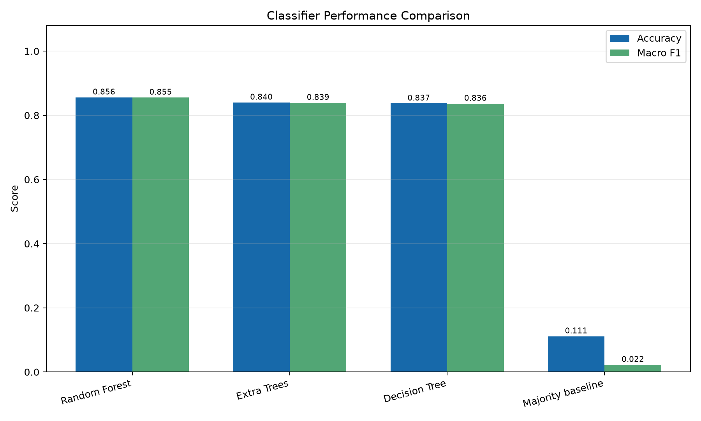
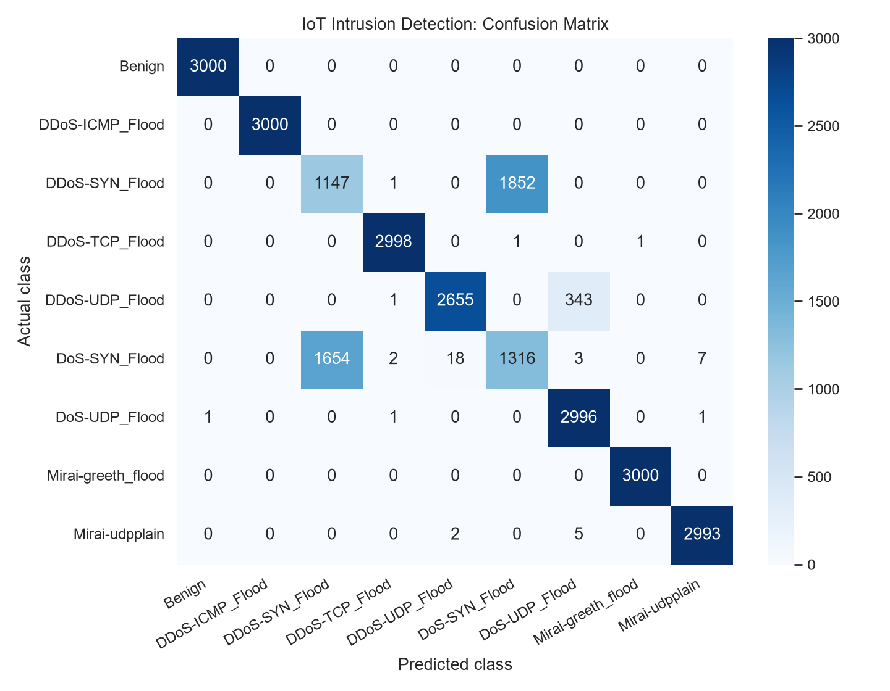
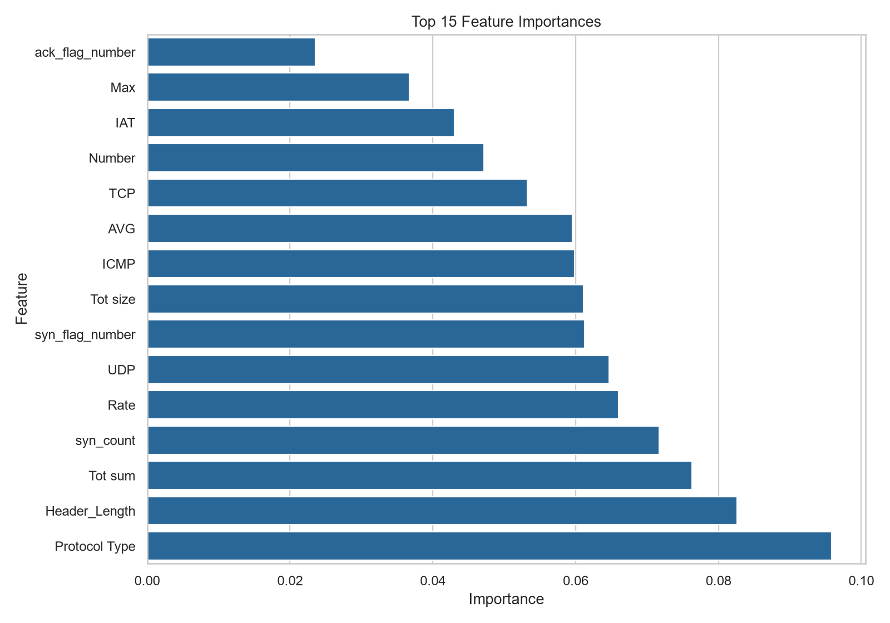

# IoT Intrusion Detection System

A data science project that classifies IoT network traffic features using machine learning. It includes a data preparation pipeline, model comparison, evaluation charts, and a Flask dashboard for CSV uploads and prediction history.

## Supported classes

The current Random Forest model predicts nine classes:

- Benign
- DDoS-ICMP_Flood
- DDoS-SYN_Flood
- DDoS-TCP_Flood
- DDoS-UDP_Flood
- DoS-SYN_Flood
- DoS-UDP_Flood
- Mirai-greeth_flood
- Mirai-udpplain

## Dataset

This project uses CSV feature files from the [CICIoT2023 dataset](https://www.unb.ca/cic/datasets/iotdataset-2023.html), provided by the Canadian Institute for Cybersecurity at the University of New Brunswick.

Place the extracted CSV category folders under:

```text
data/raw/CSV/
```

The preparation script samples files 0, 1, and 2 for training, and file 3 for testing for each class. It removes rows with missing or infinite feature values. Keep the original dataset files unchanged.

## Model comparison and evaluation

The classifiers were trained and evaluated on the same file-separated split: 81,000 training rows and 26,998 test rows. Random Forest performed best by macro-F1 on this split.

| Model | Accuracy | Macro F1 | Weighted F1 |
|---|---:|---:|---:|
| Random Forest | 0.8558 | 0.8554 | 0.8553 |
| Extra Trees | 0.8399 | 0.8392 | 0.8392 |
| Decision Tree | 0.8371 | 0.8364 | 0.8364 |
| Majority baseline | 0.1111 | 0.0222 | 0.0222 |



The main challenge was distinguishing **DDoS-SYN_Flood** from **DoS-SYN_Flood**. The DDoS-SYN_Flood recall was 0.38, and the DoS-SYN_Flood recall was 0.44. DDoS-UDP_Flood and DoS-UDP_Flood were also sometimes confused.

### Confusion matrix



### Most important model features



Feature importance shows which inputs the trained Random Forest used most when making predictions. It does not show that a feature causes an attack.

## Project structure

```text
IoT-Intrusion-Detection-System/
├── app.py
├── data/
│   ├── raw/                 # Original CICIoT2023 CSV files
│   └── processed/           # Prepared data and SQLite history
├── models/                  # Saved machine-learning models
├── reports/
│   ├── confusion_matrix.png
│   ├── feature_importance.png
│   ├── model_comparison.csv
│   └── model_comparison.png
├── src/
│   ├── compare_models.py
│   ├── plot_model_comparison.py
│   ├── plot_results.py
│   ├── prepare_data.py
│   └── train_model.py
├── static/
│   └── style.css
└── templates/
    ├── history.html
    ├── index.html
    └── results.html
```

## Setup

Open a terminal in the project folder. Activate the virtual environment if needed:

```powershell
.\venv\Scripts\Activate.ps1
```

Install the required packages:

```powershell
pip install -r requirements.txt
```

## Prepare the data

```powershell
python .\src\prepare_data.py
```

This creates:

```text
data/processed/ids_multiclass.csv
```

## Train the model

```powershell
python .\src\train_model.py
```

This saves the trained model to:

```text
models/ids_random_forest_multiclass.joblib
```

> Model files are generated locally and are not stored in this repository. After preparing the dataset, run `python .\src\train_model.py` before starting the dashboard.

## Compare classifiers

```powershell
python .\src\compare_models.py
```

This writes the classifier metrics to:

```text
reports/model_comparison.csv
```

## Generate charts

```powershell
python .\src\plot_results.py
python .\src\plot_model_comparison.py
```

These scripts create the confusion matrix, feature importance, and model comparison charts in `reports/`.

## Run the dashboard

```powershell
python .\app.py
```

Open this address in a browser:

```text
http://127.0.0.1:5000
```

Upload a CSV file containing the numeric feature columns used by the model. The dashboard displays predicted classes, an alert summary, and a preview of predictions. Successful analyses are recorded in:

```text
data/processed/ids_history.db
```

Stop the local server with **Ctrl+C** in the terminal.

## Limitations

- This is a CSV-based prototype; it does not capture live network traffic.
- Evaluation uses held-out files from CICIoT2023. The test files are separate from the training files, but come from the same dataset.
- Results on other networks or datasets may differ.
- The model predicts only the nine classes listed above. Other traffic may be assigned to one of them.
- The dashboard alert reflects model predictions, not a verified security incident.